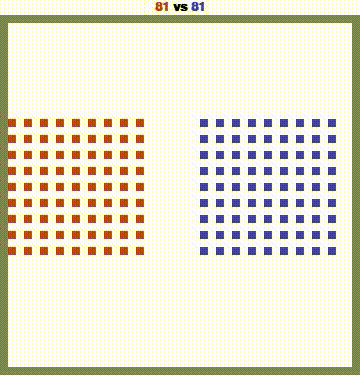
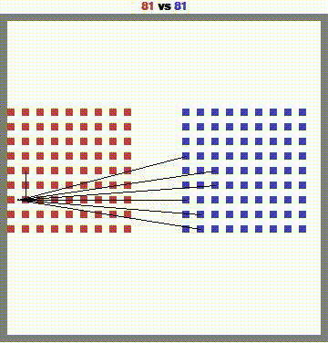
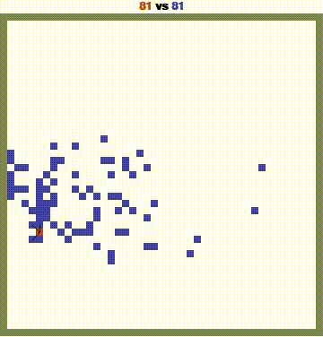

# 🎮 Battle Royale AI Agents with MAgent2

Reinforcement Learning project using the MAgent2 framework - Group 18

## 🎬 Demo Battles

Watch our best AI agents compete against different opponents:

### 🆚 Random Agent

<p align="center">
 
</p>

### 🆚 Red.pt Agent  

<p align="center">
 
</p>

### 🆚 Final Red Agent

<p align="center">
 
</p>

<h2 align="center">🏆 GGWP! </h2>

## 🚀 Getting Started

### Prerequisites

1. Clone this repository:

2. Install dependencies:
```bash
pip install -r requirements.txt
```

## 📊 Reproduce Our Results
### Training
- Open `train.ipynb` for the training pipeline of best model
- Training logs available in `src/`
### Evaluation
- Use `eval.ipynb` to evaluate best models
- Detailed evaluation metrics and results in `src/`
- Model checkpoints  in `weight_models`
## 🔍 Project Structure
```
.
├── train.ipynb          # Training notebook
├── eval.ipynb           # Evaluation notebook  
├── src/                 # Source code
    ├── rnn_agent/      # RNN Agent implementation
    ├── qmix/           # QMIX implementation
    ├── vdn/            # VDN implementation  
    ├── DQN/            # DQN implementation
    └── rule_based/     # Rule-based implementation
```
## 📚 References

1. [MAgent2 GitHub Repository](https://github.com/Farama-Foundation/MAgent2)
2. [MAgent2 API Documentation](https://magent2.farama.org/introduction/basic_usage/)

## 👥 Contributors

**Group 18 Members:**

- Bùi Đức Mạnh (22022602)
- Đàm Thái Ninh (22022522) 
- Lê Việt Hùng (22022666)

---

<p align="center">
  Made with 💖 by Group 18
</p>
